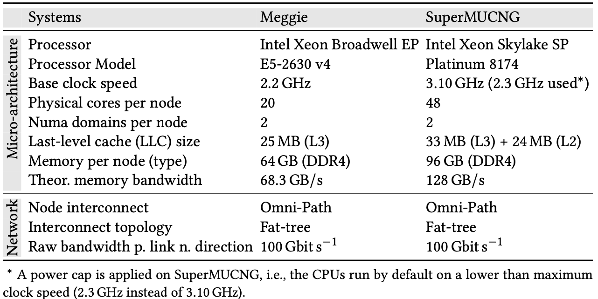
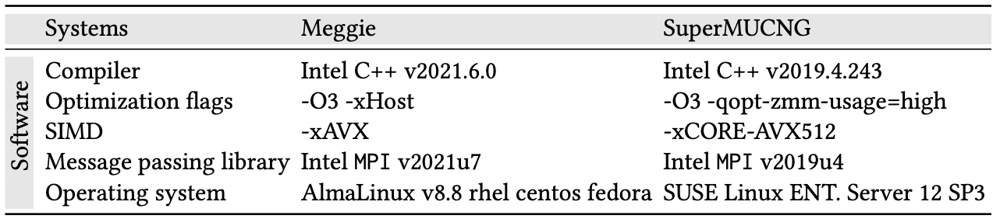
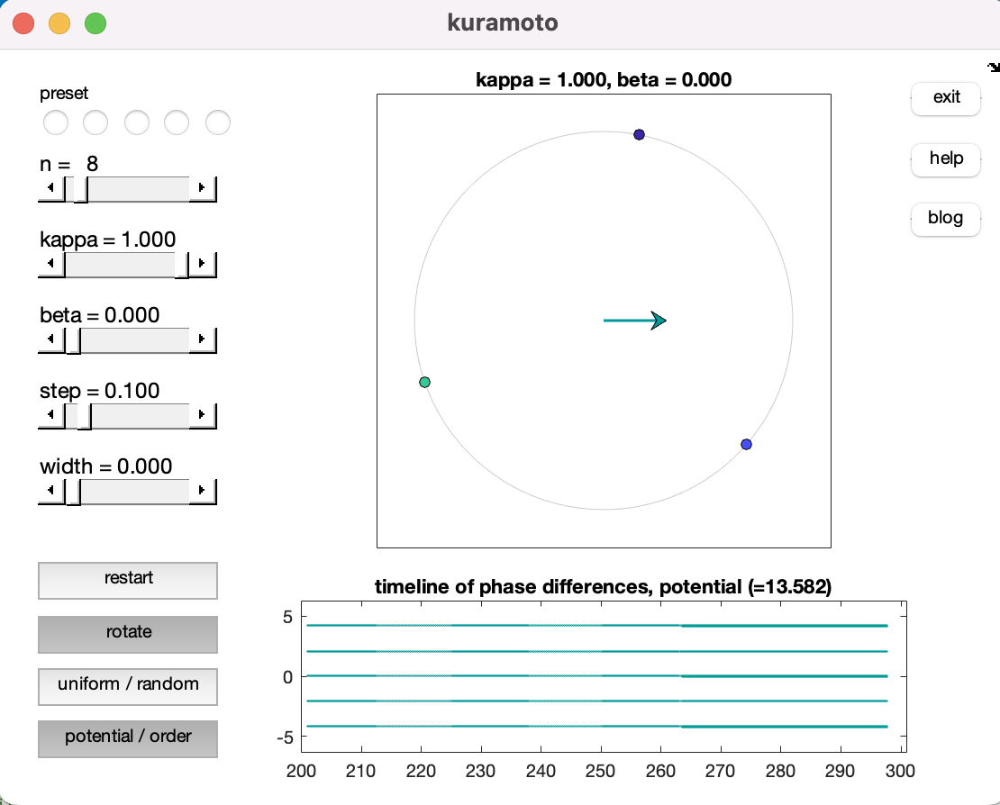
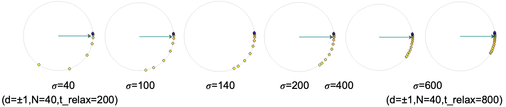
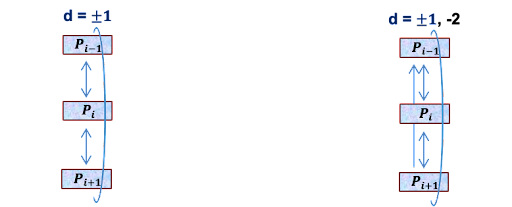

# Artifact Description (AD) / Artifact Evaluation (AE)
# Title: Physical Oscillator Model for Supercomputing

### Table of Contents

* [A. Abstract](#Abstract)
* [B. Description](#Description)
    * [B.1 Check-list (artifact meta information)](#Check-list)
        * [B1.1.1 Algorithms and Programs](#Programs)
        * [B1.1.2 Compilation](#Compilation)
        * [B1.1.3 Binary](#Binary)
        * [B1.1.4 Hardware](#Hardware)
        * [B1.1.5 Run-time environment and state](#state)
        * [B1.1.6 Output](#Output)
        * [B1.1.7 Publicly available?](#available)
    * [B.2. How software can be obtained (if available)](#software)
    * [B.3. Hardware dependencies](#HWD)
    * [B.4. Software dependencies](#SWD)
    * [B.5. Datasets](#Datasets)
* [C. Installation](#Installation)
* [D. Experiment workflow](#WF)
* [E. Evaluation and expected result](#Evaluation)
* [D. Experiment workflow](#WF)
* [F. Experiment customization](#Experiment)
* [G. Results Analysis Discussion](#Results)
* [H. Summary](#Summary)
* [I. Notes](#Notes)

<a name="Abstract"></a>
## A. Abstract
A parallel program together with the parallel hardware it is running on is 
not only a vehicle to solve numerical problems, it is also a
complex system with interesting dynamical behavior: resynchronization and
desynchronization of parallel processes, propagating phases of idleness, and
the peculiar effects of noise and system topology are just a few
examples. We propose a physical oscillator model (POM) to describe 
aspects of the dynamics of interacting parallel processes. Motivated
by the well-known Kuramoto Model, a process with its
regular compute-communicate cycles is modeled as an oscillator which is
coupled to other oscillators (processes) via an interaction potential. 
Instead of a simple all-to-all connectivity as in the standard Kuramoto
model, we employ a sparse topology matrix mapping the communication structure 
and thus the inter-process dependencies of the program onto the 
oscillator model and propose two interaction potentials
that are suitable for different scenarios in parallel computing: 
\emph{resource-scalable} and \emph{resource-bottlenecked} 
applications. The former are not limited by a resource bottleneck such
as memory bandwidth or network contention, while the latter are. 
As opposed to the original Kuramoto model, which has a periodic
sinusoidal potential that is attractive for small angles,
our characteristic potentials are always attractive for large 
angles and only differ in the short-distance behavior. 
We show that the model with appropriate potentials can mimic
the propagation of delays and the synchronizing and desynchronizing 
behavior of scalable and bottlenecked parallel programs, respectively.

<a name="Description"></a>
## B. Description
We further provide an artifact description and an artifact evaluation appendix at [https://github.com/RRZE-HPC/OSC-AD](https://github.com/RRZE-HPC/OSC-AD). 
To allow a third party to duplicate the findings, this article describes the MATLAB source code for the implementation of the Physical Oscillator Model (POM) and the additional information about software environments and experimental design and method used for the results shown in the paper, entitled "Physical Oscillator Model for Supercomputing".
It further contains the videos of additional outcomes that, owing to page restrictions, cannot be included in this paper.

<a name="Check-list"></a>
### B.1 Check-list (artifact meta information)

<a name="Programs"></a>

- **B1.1.1 Algorithms and Programs**:
We employed the MPI parallel programming model for three parallel benchmarks.
```
1. MPI-parallel PISOLVER code -- mimics resource-scalable parallel programs -- calculates the value of pi using the midpoint rule with 500 M steps.
2. MPI-parallel STREAM Triad -- mimic resource-bottlenecked parallel programs -- sweep A(:)=B(:)+s*C(:)) alternating with MPI pair-wise MPI_Irecv, MPI_Send and MPI_Wait routines.
3. MPI-parallel slow Sch�nauer vector Triad --- sweep A(:)=B(:)+cos(C(:)/D(:)) alternating with MPI pair-wise MPI_Irecv, MPI_Send and MPI_Wait routines; The low-throughput cosine and floating-point division shifts the bandwidth saturation point to a higher number of cores.
```
First program results in process scalability (no contention on memory interfaces, shared caches, or network interfaces), while the latter causes contention across processes.

<a name="Compilation"></a>

- **B1.1.2 Compilation**:
The C++ programming language is employed by all three MPI-parallel benchmarks.
```     
CXX: "mpiicpc"
STD optimizations: "-O3"
SIMD optimizations (Meggie): "-xHost -xAVX"
SIMD optimizations (SuperMUC-NG): "-xCORE-AVX512 -qopt-zmm-usage=high"
Intel Trace Analyzer and Collector, ITAC: "-trace"
```

<a name="Binary"></a>

- **B1.1.3 Binary**
```
x86
```

<a name="Hardware"></a>

- **B1.1.4 Hardware**  
To ensure the broad applicability of our results, we conducted most
experiments on two systems having significant differences in the numbers of cores per ccNUMA domains and memory bandwidth:
```
1. Meggie: 10 core Intel Xeon Broadwell E5-2630 v4 CPUs and fat-tree 100 Gbit/s Omni-Path 
2. SuperMUC-NG: 24 core Intel Xeon Skylake SP Platinum 8174 CPUs and fat-tree 100 Gbit/s Omni-Path 
```
    
Key hardware specifications of systems are described below:


<a name="state"></a>

- **B1.1.5 Run-time environment and state**:
A comprehensive state description of the system that was utilized to conduct the experiments depicted in the paper's figures can be found in [`Meggie_state.csv`](Meggie_state.csv).
This lists comprehensive hardware information on 

     - libraries and compilers along with their versions 
     - operating system kernel, version and other details
     - CPUset
     - topology (cores, cache, NUMA)
     - NUMA balancing
     - general memory details 
     - transparent huge pages
     - performance energy bias
     - hardware power limits

<a name="Output"></a>

- **B1.1.6 Output**

The work considers the runtime of each process at each iteration in `seconds` and the delay propagation speed in `ranks/sec` as primary metrics.

<a name="available"></a>

- **B1.1.7 Publicly available?**
```
yes
```

<a name="software"></a>
### B.2. How software can be obtained (if available)
To download the software's, check out the following websites: 

* POM implementation: [https://tiny.cc/PMBS23-OSC-AD](https://tiny.cc/PMBS23-OSC-AD)
* Intel C++ compiler: [https://software.intel.com/content/www/us/en/develop/tools/oneapi/components/dpc-compiler.html](https://software.intel.com/content/www/us/en/develop/tools/oneapi/components/dpc-compiler.html)
* Intel MPI library: [https://intel.com/content/www/us/en/developer/tools/oneapi/mpi-library.html](https://intel.com/content/www/us/en/developer/tools/oneapi/mpi-library.html)
* Intel Trace Analyzer and Collector: [https://software.intel.com/en-us/trace-analyzer](https://software.intel.com/en-us/trace-analyzer)
* MATLAB: [https://matlab.mathworks.com](https://matlab.mathworks.com)

<a name="HWD"></a>
### B.3. Hardware dependencies
Experiments were conducted on SuperMUC-NG (Intel Xeon Skylake SP CPUs) at the power-capped clock-frequency of 2.3 GHz (fixed, turbo disabled), and on ClusterB (Intel Xeon Broadwell CPUs) at base clock-frequency of  2.2 GHz (fixed, turbo disabled).
The reproducibility of experiments requires mapping consecutive MPI processes to consecutive cores and fixing the frequency and switching-off the turbo mode.

<a name="SWD"></a>
### B.4. Software dependencies
The MATLAB model's implementation and Intel Trace Analyzer and Collector (ITAC) utilizes the following version updates. 

* MATLAB model's implementation, version 2023, update 0
* MATLAB tool, version 2022, update R2022a
* Intel Trace Analyzer and Collector, version 2021, update 6

Key software specifications on both systems are described below:



<a name="Datasets"></a>
### B.5. Datasets

1. Resource-scalable parallel programs: The MPI-parallel PISOLVER code comprises a large number of back-to-back double-precision divide instructions, whose throughput is exactly one instruction per 16 clock cycles on Broadwell.
2. Resource-bottlenecked parallel programs: Working sets were chosen large enough to not fit into any cache, which is at least 10x the last-level cache size, i.e., L3 caches (non-inclusive victim L3+L2 caches) in the Broadwell (Skylake) processors of ClusterB (SuperMUC-NG).
    Data sharing across overlapping kernels was ruled out to eliminate the possibility of cache reuse.
     *  MPI-parallel McCalpin STREAM TRIAD, A(:)=B(:)+s*C(:):
        An overall working set of 48 GB (2 x 10^9 elements) on ClusterB and 1.2 GB (5 x 10^7 elements) on SuperMUC-NG is split evenly across the MPI processes, respectively.
     * MPI-parallel slow Sch�nauer TRIAD, A(:)=B(:)+cos(C(:)/D(:)):
        An overall working set of 1.6 GB (5 x 10^7 elements) on SuperMUC-NG is split evenly across the MPI processes.

    After each full loop traversal, each MPI rank `i` sends and receives data to and from each of its direct neighbors `i + 1` and `i - 1`. The process topology is an open-chain.

<a name="Installation"></a>
## C. Installation
Please install above-mentioned software dependencies.

<a name="WF"></a>
## D. Experiment workflow
To reproduce the experimental results, git clone the following repository:

```
git clone https://github.com/RRZE-HPC/OSC-AD && cd OSC-AD
```

Run the [kuramoto.m](kuramoto.m) script and generate results using the available configuration options shown. Below is a sample output visualisation:




## Defining communication typologies
Communication typologies `T_{ij}` of MPI-parallel micro-benchmarks are described below.

```matlab
topology = zeros(n);
for i = 1:N
    for j = 1:N  
    	x = j-i;
        d = ...; % 1 (next) or 2 (next-to-next) communication only
        if ...
        (x == d) % lower dth sub-diagonal (non-periodic)
        (-x == d) % upper dth sub-diagonal (non-periodic)
        ((-x == d) | (x == n-d)) % upper dth and lower (n-d)th sub-diagonal (periodic)
        ((x == d) | (-x == n-d)) % lower dth and upper (n-d)th sub-diagonal (periodic)
        (abs(x) == d) % both upper and lower dth sub-diagonal (non-periodic)
        ((abs(x) == d) | (abs(x) == n-d)) % both upper and lower dth and (n-d)th sub-diagonals (periodic) 
            topology(j,i) = 1;
        end       
    end
end
```

<a name="Evaluation"></a>
## E. Evaluation and expected result
Run the MATLAB implementation according to the README file and compare the results in the paper. 
Validation of our Physical Oscillator Model (POM) was done by applying comparison with experimental collected traces on two platforms.
Navigate to the links of Google documents, mentioned in Section G of this article, to access the videos of stored measured results.
If executed on the same hardware as described, we anticipate that these figures will be within the bounds of those in the paper.

<a name="Experiment"></a>
## F. Experiment customization
We took a number of measures to create a reproducible experimental environment and minimize any noise from system sources.
Before actual measurements were taken, at least 50 warm-up time steps with barrier synchronization were performed to allow the MPI runtimes to settle and eliminate first-call overhead. 
In MPI programs, noise or one-off delays were generated by extending the computational phase on certain MPI ranks via doing extra work.

<a name="Results"></a>
## G. Results analysis discussion
Communication delays for non-blocking calls were measured by time spent in the `MPI_Waitall` function. 

## Boilerplate graphical visualization output
In the figure above [POMviz.png](POMviz.png), we show the output from the MATLAB model's implementation.
Beyond the `circle diagram` option for result visualization, implementation display two further options:  

1. the `timeline of phase differences` for oscillators 
2. the `timeline of potentials` 

See Listings below for both.

1. Timeline visualization of phase-differences for oscillators.
    ```matlab
    for j = 1:length(t)
        g=dot(topology,theta(:,j)-theta(:,j)',2)
        fprintf(outputfile,'%6.3f %6.3f \n',t,g); 
    end
    ```

2. Boilerplate graphical visualization for potential.
    ```matlab
    for j = 1:length(t)
        v=sum(dot(topology,tanh(abs(theta(:,j)-theta(:,j)')),2))
        fprintf(outputfile,'%6.3f %6.3f \n',t,v);
    end
    ```

## Impact of `sigma` for resource-bottlenecked programs
The following figure shows the effect of `sigma` (from `Equation 4 of paper`) for the resource-bottlenecked programs.



## Videos: MPI programs analogy with POM
Two communication typologies are considered for each case: 

1. `d=+-1`, i.e., process `P_i` send and receive from `P_{i+1}` and `P_{i-1}` processes
2. `d=+-1, -2`, i.e., process `P_i` receive from `P_{i+1}` and `P_{i-1}`, while send to `P_{i+1}`, `P_{i-1}` and `P_{i-2}`
   


POM results for analogy with two MPI-parallel codes were considered for two systems; press the play button to watch the videos for 30 iterations runs. 

* MPI-parallel PISOLVER code on 2 SuperMUC-NG sockets
     *  POM: [https://docs.google.com/drawings/d/18rspIRpGvnWx7yZ1XUULge1WRc9aCfhGJSnt-K_kzlQ](https://docs.google.com/drawings/d/18rspIRpGvnWx7yZ1XUULge1WRc9aCfhGJSnt-K_kzlQ)
     *  MPI code: [https://docs.google.com/drawings/d/18EbRRCYU-U9CimlWYye8KP_PHVWdM0fbZe7lPKp_YLs](https://docs.google.com/drawings/d/18EbRRCYU-U9CimlWYye8KP_PHVWdM0fbZe7lPKp_YLs)
[](pi_30.mp4)
[](pi_30_d3.mp4)
 
* MPI-parallel STREAM Triad on 4 ClusterB sockets
     *  POM: [https://docs.google.com/drawings/d/1U-C7aTMwkm5PUTqDf9ecIPL7idGeqj6X1xjVkVxxeDc](https://docs.google.com/drawings/d/1U-C7aTMwkm5PUTqDf9ecIPL7idGeqj6X1xjVkVxxeDc)
     *  MPI code: [https://docs.google.com/drawings/d/1ytbTzhhML29RrI71FuHm3k3I5UicmeQSH3xEdzfiT6w](https://docs.google.com/drawings/d/1ytbTzhhML29RrI71FuHm3k3I5UicmeQSH3xEdzfiT6w)
[](triad_30.mp4)
[](triad_30_d3.mp4)


<a name="Summary"></a>
## H. Summary
Please see the Section 6 of the paper that presents the summary.

<a name="Notes"></a>
## I. Notes

Please cite the work as:

* A. Afzal, G. Hager, and G. Wellein: Physical Oscillator Model for Supercomputing. [DOI:10.1145/3624062.3625535](https://doi.org/10.1145/3624062.3625535)

Bibtex:  
> @INPROCEEDINGS{POM2023,  
>   author={A. {Afzal} and G. {Hager} and G. {Wellein}},  
>   booktitle={2023 IEEE/ACM Performance Modeling, Benchmarking and Simulation of High Performance Computer Systems (PMBS)},   
>   title={Physical Oscillator Model for Supercomputing},   
>   year={2023},  
>   doi={10.1145/3624062.3625535}} 

